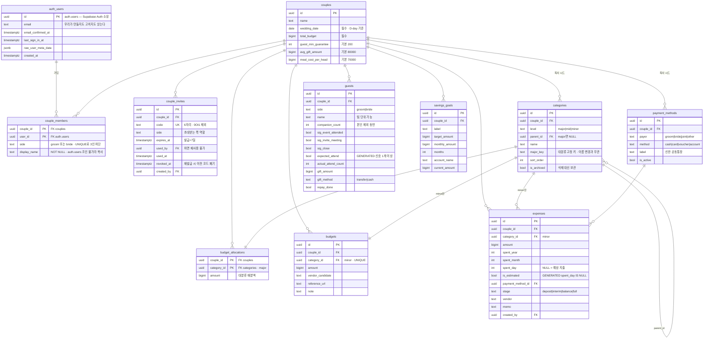

# ERD — 데이터 모델 물리 설계

> [product.md 4단계](./product.md#4단계--데이터-모델-supabase--postgres)의 논리 설계에
> 실제 타입·제약·인덱스를 입힌 것이다.
>
> **2026-07-31 확정 — `supabase/migrations/0001~0007`로 구현됐다.**
> 스키마를 바꾸려면 이 문서와 마이그레이션을 **같이** 고친다. 진실은 마이그레이션 쪽에 있다.
>
> 표기: 🔵 product.md에 이미 있던 것 · 🟡 이 문서에서 새로 정한 것

---

## 0. 물리 설계의 뼈대 — 확정된 5가지 (→ D-025, D-026)

### ✅ ① `expenses.is_confirmed`가 `is_estimated`와 중복된다 → **뺀다** (D-026)

product.md에는 두 컬럼이 다 있는데, 구현(`fixtures.ts:394`)에서 확정 여부는 **오직 `day IS NULL`**
하나로만 판정한다. `is_confirmed = NOT is_estimated`라 같은 사실을 두 번 저장하는 셈이고,
둘이 어긋나는 순간 어느 쪽이 진실인지 알 수 없다.

**제안: `is_confirmed`를 뺀다.** 확정/예상은 `is_estimated` 생성 컬럼 하나로 판정한다.
(※ "지출을 등록했지만 아직 실제로 돈이 나가지 않았다" 같은 **별도 상태**를 의도하신 거라면
남겨야 한다 — 그 경우 이름을 `is_paid`로 바꾸는 편이 오해가 없다.)

### ✅ ② 금액 타입 — `bigint`(원 단위 정수)

`numeric`은 원화에 과하고 느리다. `int`는 상한이 21억이라 총예산·축의금 합계에서 아슬아슬하다.
→ **`bigint`, 원 단위 정수, 소수점 없음.** 화면은 이미 `lib/format.ts`가 정수를 전제로 포맷한다.

### ✅ ③ enum을 `text + CHECK`로 한다

Postgres의 `CREATE TYPE ... AS ENUM`은 값 하나 추가하는 데도 마이그레이션이 필요하고 되돌리기가 어렵다.
방금 `payer`에 `other`를 넣은 것(→ D-023) 같은 일이 또 생길 것이다.
→ **`text` + `CHECK (col IN (...))`.** 값 추가는 제약 교체 한 줄이면 된다.

### ✅ ④ 집계는 View로 한다 (RPC 아님)

View는 **RLS를 그대로 상속**하므로 권한 로직을 두 번 쓰지 않아도 된다.
Server Component에서 그냥 `select`하면 되고 타입 생성도 자동으로 따라온다.
→ 인자가 필요하거나 쓰기를 하는 것(`redeem_invite(code)`)만 RPC로 남긴다.

⚠️ **단, `security_invoker`는 기본값이 아니다.** 그냥 만들면 View는 **소유자 권한**으로 돌아
호출자의 RLS를 건너뛴다 — 남의 커플 결산이 보이는 View가 된다. 반드시 명시한다:

```sql
CREATE VIEW v_settlement
WITH (security_invoker = on)   -- 이 줄이 없으면 RLS가 안 걸린다
AS SELECT ...;
```

### ✅ ⑤ 카테고리 삭제 규칙 — `ON DELETE RESTRICT`

보관(archive) 정책(→ D-016)과 짝을 이룬다. 지출이 참조 중인 카테고리는 DB 레벨에서 삭제를 막고,
화면에서는 `is_archived`로만 감춘다. 커플 자체가 지워질 때는 전부 `CASCADE`.

---

## 1. 전체 ERD

> **확대해서 보려면 [docs/erd-diagram.html](./erd-diagram.html)** — 드래그로 이동, 휠·버튼으로 확대되는 뷰어다.
> 아래 다이어그램과 같은 내용이므로 **한쪽을 고치면 다른 쪽도 고쳐야 한다.**



**모든 테이블에 `couple_id`가 있다.** 조인을 줄이려는 게 아니라 **RLS 정책을 한 줄로 통일**하기
위해서다 — 정책마다 상위 테이블을 거슬러 올라가면 재귀와 성능 양쪽에서 문제가 생긴다.

---

## 2. 테이블 상세

### 2-0. `auth.users` — **우리 테이블이 아니다**

Supabase Auth가 소유하는 테이블이다. `auth` 스키마에 있고, 프로젝트를 만드는 순간 이미 존재한다.
**우리 마이그레이션은 이걸 만들지도, 컬럼을 더하지도 않는다.** `couple_members.user_id` 등에서
`references auth.users(id)`로 **참조만** 한다.

| 컬럼 | 쓰임 |
|---|---|
| `id` | 🔵 우리가 FK로 잡는 유일한 컬럼. `auth.uid()`가 이 값을 돌려준다 |
| `email` | 매직링크 수신 주소 |
| `email_confirmed_at` | 링크를 눌렀는지 |
| `last_sign_in_at` | |
| `raw_user_meta_data` | OAuth 프로필(카카오 등)이 들어오는 자리. 2차 백로그 |

#### ⚠️ 함정 — 상대방의 이메일·이름을 여기서 읽을 수 없다

Supabase는 `auth` 스키마를 **PostgREST에 노출하지 않는다.** 클라이언트가 얻을 수 있는 건
`auth.getUser()`로 조회하는 **자기 자신뿐**이고, 다른 사용자의 행은 조회 경로 자체가 없다.

그런데 `/settings/invite`의 멤버 목록은 상대를 보여줘야 한다:

```
  현재 멤버
  · 예랑  나
  · 예신  아직 참여 안 함     ← 참여했다면 여기에 상대 이름이 떠야 한다
```

**그래서 `couple_members.display_name`이 있다.** 참여하는 시점에 본인 이름을 우리 테이블에
복사해 두는 것이다. `auth.users`를 조인해서 가져오는 설계는 애초에 불가능하다.

- 🟡 `display_name`을 **NOT NULL**로 둔다 — 비어 있으면 멤버 목록에 표시할 게 없다.
  온보딩·초대 수락 화면에서 이름을 필수로 받는다.
- 🔵 이메일까지 보여줄 필요는 없다고 본다. 둘뿐인 스페이스에서 이름이면 충분하다.
- 별도 `profiles` 테이블은 **두지 않는다.** 사용자 1명이 커플 1개에만 속하는 구조라
  `couple_members`가 곧 프로필 자리다. 나중에 한 사람이 여러 스페이스를 갖게 되면 그때 분리한다.

### 2-1. 스페이스 · 인증

#### `couples` — 커플 스페이스 하나 = 결혼 준비 하나

| 컬럼 | 타입 | 제약 | 비고 |
|---|---|---|---|
| `id` | `uuid` | PK, `default gen_random_uuid()` | |
| `name` | `text` | NOT NULL | "우리 결혼 준비" |
| `wedding_date` | `date` | NOT NULL | 🔵 홈 D-day |
| `total_budget` | `bigint` | NOT NULL, `CHECK >= 0` | 🔵 예산 화면 전체의 분모 |
| `guest_min_guarantee` | `int` | NOT NULL, `default 200` | 🔵 보증인원 갭 |
| `avg_gift_amount` | `bigint` | NOT NULL, `default 80000` | 🔵 예상 축의금 |
| `meal_cost_per_head` | `bigint` | NOT NULL, `default 70000` | 🔵 미달 시 추가 식대 |
| `created_at` | `timestamptz` | NOT NULL, `default now()` | 🟡 |

#### `couple_members` — 누가 이 스페이스에 속하는가

| 컬럼 | 타입 | 제약 | 비고 |
|---|---|---|---|
| `couple_id` | `uuid` | FK → `couples` **CASCADE** | |
| `user_id` | `uuid` | FK → `auth.users` **CASCADE** | |
| `side` | `text` | NOT NULL, `CHECK IN ('groom','bride')` | |
| `display_name` | `text` | **NOT NULL** | 🟡 `auth.users`를 조인할 수 없어서 여기 복사한다 (→ 2-0) |
| `created_at` | `timestamptz` | NOT NULL, `default now()` | 🟡 |

- **PK** `(couple_id, user_id)`
- **UNIQUE** `(couple_id, side)` — 🔵 side당 1명. **3인 진입을 DB가 막는다**

#### `couple_invites` — 1회용 초대 코드

| 컬럼 | 타입 | 제약 | 비고 |
|---|---|---|---|
| `id` | `uuid` | PK | |
| `couple_id` | `uuid` | FK **CASCADE** | |
| `code` | `text` | **UNIQUE**, NOT NULL, `CHECK length = 6` | 🔵 혼동 문자 `0 O 1 I` 제외 |
| `side` | `text` | NOT NULL, `CHECK IN ('groom','bride')` | 🔵 발급 시점의 남은 역할로 고정 |
| `expires_at` | `timestamptz` | NOT NULL | 🔵 발급 + 7일 |
| `used_by` | `uuid` | FK → `auth.users`, NULL | 차면 재사용 불가 |
| `used_at` | `timestamptz` | NULL | |
| `revoked_at` | `timestamptz` | NULL | 🟡 재발급 시 이전 코드를 여기 찍어 무효화 (→ D-029) |
| `created_by` | `uuid` | FK → `auth.users` | |

- 🟡 **부분 UNIQUE 인덱스** `(couple_id) WHERE used_by IS NULL AND revoked_at IS NULL` —
  미사용·미폐기 코드는 커플당 1개. 재발급 시 이전 코드 즉시 무효(→ product.md)를 DB가 보장한다.
  술어를 `expires_at > now()`로 쓸 수 없어 `revoked_at`을 따로 둔 것이다 —
  **부분 인덱스 술어에는 IMMUTABLE 식만 올 수 있다** (→ D-029).

### 2-2. 마스터 데이터 (가입 시 복사 시드 → D-015)

#### `categories` — 3단 트리

| 컬럼 | 타입 | 제약 | 비고 |
|---|---|---|---|
| `id` | `uuid` | PK | |
| `couple_id` | `uuid` | FK **CASCADE** | |
| `level` | `text` | NOT NULL, `CHECK IN ('major','mid','minor')` | |
| `parent_id` | `uuid` | FK → `categories` **CASCADE**, NULL | major면 NULL |
| `name` | `text` | NOT NULL | |
| `major_key` | `text` | `CHECK IN ('wedding','honeymoon','household','home')`, 대분류만 NOT NULL | 🟡 이름과 무관한 고정 키 (→ D-027) |
| `sort_order` | `int` | NOT NULL, `default 0` | 🔵 ↑↓ 버튼으로 조정 (→ D-020) |
| `is_archived` | `bool` | NOT NULL, `default false` | 🔵 삭제 대신 보관 (→ D-016) |

- 🟡 **CHECK** `(level = 'major') = (parent_id IS NULL)` — 대분류만 뿌리라는 규칙을 DB로 강제
- 🟡 **CHECK** `(level = 'major') = (major_key IS NOT NULL)` + **UNIQUE** `(couple_id, major_key)`
- 🟡 **INDEX** `(couple_id, parent_id, sort_order)` — 트리 화면이 이 순서로 읽는다
- 🔵 **대분류 4개는 추가·삭제 금지.** 이름 변경만 허용 — 배분·차트 색·결산 구조가 4개에 묶여 있다.
  **추가 금지는 위 `major_key` 제약으로 DB가 막는다**(다섯 번째는 쓸 키가 없다).
  삭제 금지만 애플리케이션 규칙으로 남는다 (→ D-027)
- 🟡 `major_key`가 있어서 차트 색·결산 집계·최종 손익이 **사용자가 이름을 바꿔도** 안 끊긴다.
  `lib/domain.ts`의 `MajorKey`와 값이 같다
- **시드**: 대 4 / 중 11 / 소 25 — `lib/mock/fixtures.ts`의 `RICH_BUDGETS`가 그대로 원본이다

#### `payment_methods` — 결제자 × 수단

| 컬럼 | 타입 | 제약 | 비고 |
|---|---|---|---|
| `id` | `uuid` | PK | |
| `couple_id` | `uuid` | FK **CASCADE** | |
| `payer` | `text` | NOT NULL, `CHECK IN ('groom','bride','joint','other')` | 🔵 `other` = 제3자 (→ D-023) |
| `method` | `text` | NOT NULL, `CHECK IN ('cash','card','voucher','account')` | |
| `label` | `text` | | 🔵 "신한 공동통장" |
| `is_active` | `bool` | NOT NULL, `default true` | 🔵 삭제 아닌 비활성 |

- 🟡 **UNIQUE** `(couple_id, payer, method)` — 같은 조합이 두 번 생기지 않게
- **시드**: 4 × 4 = **16 조합**

### 2-3. 예산

#### `budget_allocations` — 대분류 배분

| 컬럼 | 타입 | 제약 | 비고 |
|---|---|---|---|
| `couple_id` | `uuid` | FK **CASCADE** | |
| `category_id` | `uuid` | FK → `categories` **RESTRICT** | major만 |
| `amount` | `bigint` | NOT NULL, `default 0`, `CHECK >= 0` | |

- 🟡 **PK** `(couple_id, category_id)` — 대분류당 배분 1행. 별도 `id`를 두지 않는다

#### `budgets` — 소분류 예산

| 컬럼 | 타입 | 제약 | 비고 |
|---|---|---|---|
| `id` | `uuid` | PK | |
| `couple_id` | `uuid` | FK **CASCADE** | |
| `category_id` | `uuid` | FK → `categories` **RESTRICT** | minor만 |
| `amount` | `bigint` | NOT NULL, `default 0`, `CHECK >= 0` | |
| `vendor_candidate` | `text` | | 🔵 후보 업체 |
| `reference_url` | `text` | | 🔵 참고 링크 |
| `note` | `text` | | |

- 🟡 **UNIQUE** `(couple_id, category_id)` — 소분류당 예산 1행

### 2-4. 지출

#### `expenses`

| 컬럼 | 타입 | 제약 | 비고 |
|---|---|---|---|
| `id` | `uuid` | PK | |
| `couple_id` | `uuid` | FK **CASCADE** | |
| `category_id` | `uuid` | FK → `categories` **RESTRICT** | minor |
| `amount` | `bigint` | NOT NULL, `CHECK > 0` | |
| `spent_year` | `int` | NOT NULL | |
| `spent_month` | `int` | NOT NULL, `CHECK 1..12` | |
| `spent_day` | `int` | NULL, `CHECK 1..31` | 🔵 **NULL = 예상 지출** (시트 규칙 그대로) |
| `is_estimated` | `bool` | `GENERATED ALWAYS AS (spent_day IS NULL) STORED` | 🔵 |
| `payment_method_id` | `uuid` | FK → `payment_methods` **RESTRICT** | payer는 여기를 조인해 얻는다 |
| `stage` | `text` | NOT NULL, `CHECK IN ('deposit','interim','balance','full')` | 🔵 (→ D-003) |
| `vendor` | `text` | | |
| `memo` | `text` | | |
| `created_by` | `uuid` | FK → `auth.users` **SET NULL**, `default auth.uid()` | 누가 입력했는지. 탈퇴해도 지출은 커플의 기록이라 남긴다 |
| `created_at` | `timestamptz` | NOT NULL, `default now()` | |

- ✅ `is_confirmed`는 **뺐다** — 위 ①번 항목 (→ D-026)
- 🟡 **INDEX** `(couple_id, spent_year, spent_month)` — 원장·타임라인이 이 순서로 읽는다
- 🟡 **INDEX** `(couple_id, category_id)` — 소분류 진행률 집계용
- 날짜를 `date` 한 컬럼이 아니라 **년/월/일 3개로 쪼갠 이유**: 일자 미정(예상 지출)을 표현해야 하는데
  `date`로는 "2026년 8월 어느 날"을 담을 수 없다. 시트의 입력 방식과도 같다

### 2-5. 하객 · 저축

#### `guests`

| 컬럼 | 타입 | 제약 | 비고 |
|---|---|---|---|
| `id` | `uuid` | PK | |
| `couple_id` | `uuid` | FK **CASCADE** | |
| `side` | `text` | NOT NULL, `CHECK IN ('groom','bride')` | |
| `name` | `text` | NOT NULL | 🔵 "교회 청년부"처럼 **팀 단위**도 한 행 |
| `companion_count` | `int` | NOT NULL, `default 0` | 본인 제외 동반 인원 |
| `sig_event_attended` | `bool` | NOT NULL, `default false` | 과거 경조사 참석 |
| `sig_invite_meeting` | `bool` | NOT NULL, `default false` | 청첩장 모임 |
| `sig_close` | `bool` | NOT NULL, `default false` | 친분 |
| `expected_attend` | `bool` | `GENERATED ALWAYS AS (sig_event_attended OR sig_invite_meeting OR sig_close) STORED` | 🔵 신호 1개 이상이면 참석 예상 |
| `actual_attend_count` | `int` | NULL | 예식 후 입력 |
| `gift_amount` | `bigint` | NULL | |
| `gift_method` | `text` | NULL, `CHECK IN ('transfer','cash')` | |
| `repay_done` | `bool` | NOT NULL, `default false` | 답례 여부 |
| `memo` | `text` | | |

- **예상 참석 인원** = `Σ(1 + companion_count)` where `expected_attend` — 본인 1명이 항상 더해진다

#### `savings_goals`

| 컬럼 | 타입 | 제약 |
|---|---|---|
| `id` | `uuid` | PK |
| `couple_id` | `uuid` | FK **CASCADE** |
| `label` | `text` | NOT NULL |
| `target_amount` | `bigint` | NOT NULL, `CHECK > 0` |
| `monthly_amount` | `bigint` | |
| `months` | `int` | |
| `account_name` | `text` | |
| `current_amount` | `bigint` | NOT NULL, `default 0` |

---

## 3. RLS

**전 테이블 공통** — 읽기·쓰기 모두 같은 조건:

```sql
couple_id = (select current_couple_id())
```

`current_couple_id()`는 `SECURITY DEFINER` 헬퍼다(→ D-018). `couple_members`에 일반 정책을 걸면
정책이 자기 테이블을 다시 조회해 **무한 재귀**가 나기 때문에, 이 함수만 RLS를 우회해 조회한다.

예외는 `couple_invites` 하나뿐이다:

| 테이블 | 왜 다른가 | 어떻게 |
|---|---|---|
| `couple_invites` | 참여하려는 쪽은 **아직 멤버가 아니라** 조회 권한이 없다 | 정책도 GRANT도 주지 않아 직접 SELECT가 아예 거부된다. `create_invite()` · `active_invite()` · `redeem_invite(code, name)` `SECURITY DEFINER` RPC로만 오간다 (→ D-017). 그래야 코드 목록을 긁어갈 수 없다 |

🟡 `couple_members`도 **예외가 아니다.** `user_id = auth.uid()`로 좁히면 내 행만 보여
멤버 목록에 상대가 뜨지 않는다. 재귀는 `current_couple_id()`가 `SECURITY DEFINER`라
애초에 일어나지 않는다 (→ D-030).

🟡 `guests`·`savings_goals`처럼 커플만 보는 테이블도 예외 없이 같은 정책을 건다.

🟡 **INSERT 정책은 `couples`·`couple_members`에 주지 않는다.** 생성은 `create_couple()` /
`redeem_invite()` RPC로만 연다 — 남의 `couple_id`를 적어 넣는 경로를 없애기 위함이다 (→ D-030).

---

## 4. 집계 View (🟡 전부 제안)

**클라이언트에서 합계를 계산하지 않는다.** 화면은 View를 그냥 `select`한다 —
지금 `fixtures.ts`의 선택자 함수가 하는 일을 그대로 DB로 옮기는 것이다(→ D-010, D-011).

| View | 산출 | 쓰는 화면 |
|---|---|---|
| `v_budget_lines` | 소분류별 예산·확정지출·잔액·진행률 | 예산, 결산 ② |
| `v_major_rollup` | 대분류별 배분·세부합·소진율 + **배분 초과 경고** | 예산, 홈, 결산 ① |
| `v_settlement` | payer별 확정지출 합 → 예랑/예신 부담, 정산액. **`other`는 제외** (→ D-023) | 결산 ③ |
| `v_monthly_timeline` | `GROUP BY spent_year, spent_month`, 확정/예상 2계열 | 결산 ④ |
| `v_guest_summary` | 예상 참석 인원, 보증인원 갭, 예상 축의금, 최종 손익 | 하객, 홈 |

전부 `WITH (security_invoker = on)`으로 만든다 → **호출자의 RLS가 그대로 적용**되어 별도 권한 로직이
필요 없다. **이 옵션은 기본값이 아니다** — 빠뜨리면 소유자 권한으로 돌아 RLS를 통과해 버린다 (0절 ④).

**검증 기준**: 이 View들이 `?fixture=sheet`와 **같은 숫자**를 내야 한다 —
`₩220,000` / `31%` / `₩490,000` / `₩13,380,000` / `₩380,000 초과` / `207명` / `13명 부족` / `₩16,560,000`.
([roadmap.md의 DoD 표](./roadmap.md#definition-of-done--시트-실측치-대조))

---

## 5. 마이그레이션 파일 구성

```
supabase/migrations/
  0001_couples_and_members.sql    couples · couple_members · couple_invites
                                  current_couple_id() 헬퍼 · RLS
  0002_master_data.sql            categories · payment_methods · RLS
  0003_seed_function.sql          seed_couple_defaults() — 대4/중11/소25 + 결제수단 16
  0004_budget_and_expenses.sql    budget_allocations · budgets · expenses · RLS
  0005_guests_and_savings.sql     guests · savings_goals · RLS
  0006_views.sql                  집계 View 5종
  0007_space_rpcs.sql             create_couple · create_invite · active_invite · redeem_invite
```

0001부터 순서대로 실행한다. 앞 파일이 만든 것을 뒤 파일이 참조한다.

스페이스 생성 RPC가 0003이 아니라 0007에 있는 이유: `create_couple()`이 대분류 배분 4행을
0원으로 깔아 두는데, 그 테이블(`budget_allocations`)은 0004에서야 생긴다.

### 확인 방법

```bash
npm run db:reset    # 로컬 Postgres를 지우고 0001~0007을 다시 적용 (Docker 필요)
npm run db:types    # 스키마 → src/lib/supabase/types.ts 재생성
```

**스키마를 고치면 `npm run db:types`를 반드시 다시 돌린다.** 안 그러면 화면 코드가
없는 컬럼을 타입 오류 없이 참조한다.
